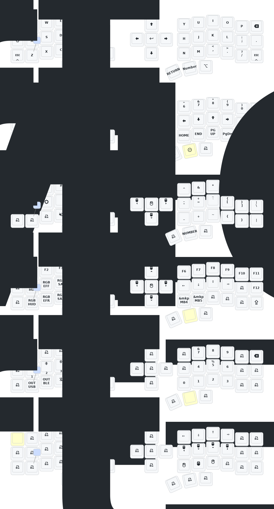

## Corne Keyboard Config

This is my custom [ZMK](https://zmk.dev/) keymap config for the **low profile** Corne (3x6) wireless keyboard.

---

## Flashing instructions

- Go to the [ZMK Keymap Editor](https://nickcoutsos.github.io/keymap-editor/), connect this repository and add the desired keys.
- Save the layout, after that go to the github actions tab and wait for the _firmware_ building process to finish.
- Download the `.zip` file and extract the files.

> You will notice that we have three files with the `.uf2` extension, we'll use them to flash the new firmware to halves.

- Turn off the keyboard halve, and plug it with the USB-C cable, reset the keyboard by pressing the "reset button" twice.
- After the controller will recognized by the computer as an external drive, copy and paste the appropriate `.uf2` file to it, the device will disconnect automatically after the flashing process.
- Do the same thing to the other halve.
- Now you need to turn on the halves and press the "reset button" one time on each halve (at the same time), so that the parts can connect and communicate between each other.

> For further information go to the [official documentation](https://v0-3-branch.zmk.dev/docs/user-setup#flashing-uf2-files) for ZMK.
